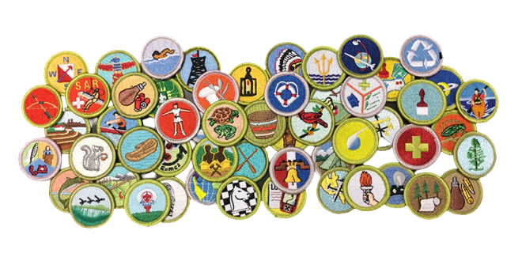

Requirement #2: Merit Badge
+++++++++++++++++++++++++++

:math:`\boxed{\mathbb{REQ}\Large \rightsquigarrow}` Complete ONE merit badge from the following list. Choose one that you have not already used toward another Nova award.
After completion, discuss with your counselor how the merit badge you earned uses agriculture.

* Chemistry
* Energy
* Engineering
* Environmental Science
* Fish and Wildlife Management Fishing
* Fly-Fishing Forestry
* Geology
* Nature
* Oceanography
* Public Health
* Soil and Water Conservation Sustainability
* Weather

   

.. attention:: Once you have completed this requirement, make sure you document it in your worksheet!
